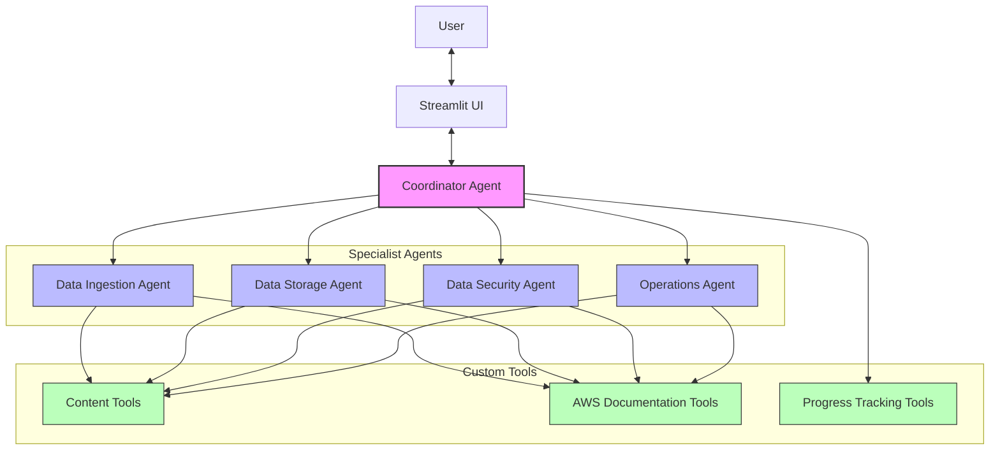

# AWS Data Engineer Interactive Course

An interactive Streamlit application for AWS Certified Data Engineer - Associate exam preparation.

## Multi-Agent Architecture



## Local Development with Docker

### Prerequisites
- Docker and Docker Compose
- AWS credentials configured locally with access to Amazon Bedrock

### Running Locally
1. Configure your AWS credentials (if not already done):
   ```bash
   aws configure
   ```
   Ensure your credentials have access to Amazon Bedrock and the Claude models.

2. Build and start the Docker container:
   ```bash
   docker-compose up --build
   ```

3. Open http://localhost:8501 in your browser

4. To stop the application:
   ```bash
   docker-compose down
   ```

## Project Structure

```
docker-app/
├── app/                  # Application code
│   ├── main.py           # Main Streamlit application
│   ├── config.py         # Configuration settings
│   ├── pages/            # Additional pages
│   │   └── dashboard.py  # Progress dashboard
│   ├── components/       # Reusable UI components
│   │   └── progress_display.py  # Progress display components
│   ├── agents/           # Multi-agent system using Strands Agents
│   │   ├── coordinator.py  # Main coordinator agent
│   │   └── ...           # Specialist agents
│   ├── tools/            # Custom tools for agents
│   │   ├── content_tools.py  # Tools for accessing study materials
│   │   └── ...           # Other tools
│   └── utils/            # Utility functions
│       ├── bedrock_client.py  # Amazon Bedrock client
│       └── progress_tracker.py # Progress tracking utility
├── Dockerfile            # Docker configuration
├── docker-compose.yml    # Docker Compose configuration
├── requirements.txt      # Python dependencies
└── README.md             # This file
```

## Multi-Agent System

The application uses a multi-agent collaboration system built with Strands Agents to provide specialized assistance for AWS Data Engineer certification preparation:

### Agent Roles

1. **Coordinator Agent**: 
   - Main interface for user interactions
   - Routes questions to appropriate specialist agents
   - Synthesizes responses from multiple agents
   - Maintains conversation context

2. **Data Ingestion Agent**:
   - Specializes in AWS data ingestion services
   - Expert on Kinesis, Glue, DMS, and related technologies
   - Provides guidance on data collection and import strategies

3. **Data Storage Agent**:
   - Focuses on AWS storage solutions
   - Expert on S3, Redshift, DynamoDB, and related services
   - Advises on data organization and storage optimization

4. **Data Security Agent**:
   - Specializes in AWS data security and governance
   - Expert on IAM, Lake Formation, KMS, and security best practices
   - Provides guidance on securing data assets

5. **Operations Agent**:
   - Focuses on monitoring, management, and optimization
   - Expert on CloudWatch, Step Functions, and operational excellence
   - Advises on pipeline orchestration and cost optimization

### Custom Tools

The agents use specialized tools to enhance their capabilities:

1. **Content Tools**: Access and retrieve information from study materials
2. **AWS Documentation Tools**: Fetch relevant AWS documentation
3. **Progress Tracking Tools**: Monitor and update user progress

### Interaction Flow

1. User submits a question through the Streamlit interface
2. Coordinator agent analyzes the question and determines which specialist(s) to consult
3. Relevant specialist agents process the question using their domain expertise
4. Coordinator synthesizes a comprehensive response
5. Response is presented to the user through the chat interface

## Features

- **Study Materials**: Comprehensive guides covering all exam domains
- **Hands-on Labs**: Step-by-step instructions for practical experience
- **Navigation**: Easy access to all content through the sidebar
- **Progress Tracking**: Track your progress through the course
- **Progress Dashboard**: Visualize your progress and continue where you left off
- **Multi-Agent AI Assistant**: Specialized AI agents for different AWS data engineering domains with Claude integration

## Development Phases

This application is being developed in phases:

- **Phase 1**: ✅ Basic setup with Docker and content navigation
- **Phase 2**: ✅ Core Streamlit app with progress tracking and multi-agent system
- **Phase 3**: ✅ Multi-agent Claude integration using Strands Agents (Completed)
- **Phase 4**: 🔄 Frontend/Backend separation with CloudScape UI (In Progress)
- **Phase 5**: ⏳ Interactive lab features (Planned)
- **Phase 6**: ⏳ Testing and refinement (Planned)
- **Phase 7**: ⏳ Documentation and deployment instructions (Planned)

## AWS Credentials Configuration

The application uses AWS credentials to access Amazon Bedrock for the Claude AI integration. Credentials are securely handled through a volume mount approach:

### How Credentials Are Managed

1. **Volume Mount**: Your local AWS credentials directory (~/.aws) is mounted as a read-only volume in the Docker container
2. **No Credentials in Code**: No AWS credentials are stored in the codebase or Docker image
3. **Runtime Access**: The application accesses credentials only at runtime

### Required Permissions

Your AWS credentials should have:
- Access to Amazon Bedrock service
- Permissions to invoke the Claude models (`bedrock:InvokeModel`)
- Access to the region where Claude models are available (default: us-west-2)

### Configuring Credentials

1. Ensure you have AWS CLI installed
2. Run `aws configure` to set up your credentials
3. Verify you have access to Amazon Bedrock in the AWS console
4. Request model access for Claude models if not already enabled

## Notes

- This is the Phase 3 implementation with multi-agent Claude integration
- The application automatically uses your local AWS credentials
- No credentials are committed to the repository
